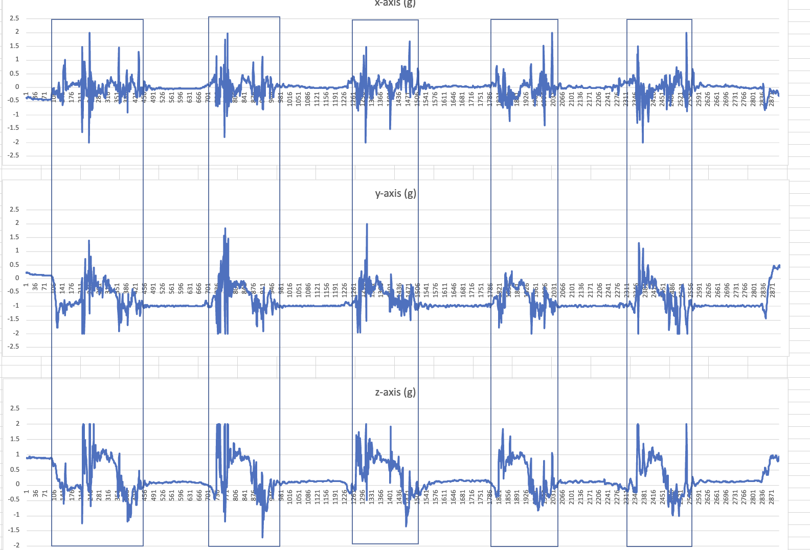

# SmartFallMM: A Multimodal Dataset for Enhanced Human Activity Recognition

  

The SmartFallMM dataset is a multimodal resource for Wearable Sensor-based Human Activity Recognition (WSHAR), providing synchronized data from 32 skeleton joint positions and accelerometers placed on wrists and hips. Collected using smartwatches, smartphones, meta sensors, and cameras, it includes daily activity data from both younger and older populations. This unique dataset supports the development of advanced machine learning models combining visual and non-visual data for enhanced activity recognition. 

<b>Paper is coming soon!</b>

## Activities and Labels

The following table provides a summary of the activities, their corresponding labels, and the participants involved:

| **Activity**                   | **Label** | **Participants**   |
|--------------------------------|-----------|--------------------|
| Drinking Water                | 1         | Young + Old        |
| Pick Up Object                | 2         | Young + Old        |
| Put On and Take Off Jacket    | 3         | Young + Old        |
| Stepping Up                   | 4         | Old                |
| Sweeping Floor                | 5         | Young + Old        |
| Washing Hand                  | 6         | Young + Old        |
| Waving Hand                   | 7         | Young + Old        |
| TUG Test/Walking              | 8         | Young + Old (TUG for Old) |
| Sit/Stand                     | 9         | Young              |
| Backfall                      | 10        | Young              |
| Frontfall                     | 11        | Young              |
| Leftfall                      | 12        | Young              |
| Rightfall                     | 13        | Young              |
| Rotatefall                    | 14        | Young              |

## Labelling of inertia/non-visual data:
We first tried to auto-label the inertia data using a Python script. The manual visualization of human-labeled to auto-labeled data sets revealed significant inaccuracies. All inertial data collected from the four joint positions are thus labeled manually for quality. In the data labeling process, the accelerometer's x-axis, y-axis, and z-axis of an activity are visualized using line plots. By visualizing these plots manually, a specific trial of activities such as falls, waving, etc, can be identified by spikes and rest periods. These activities are marked with rectangular boxes aligned across the axes. Figure 2 shows an example of labeling 5 trials of back fall. Humans can more accurately identify the beginning and end of each trial. Once each trial is isolated in the box, the data within the box gets copied into a named Excel file to be used as one sample input to the machine learning model.

   
  <strong>Figure 2: Example of labeling 5 trials of back fall</strong>

## Labelling of skeleton/visual data:
The recorded video file from the middle camera is used as a guide to label the skeleton data. The first column of the Excel file of the skeleton data is the video recording frame number. We played the recorded video and marked the initial and the ending frames of each trail of each activity. We then go to the Excel file of the skeleton data of that activity, crop the data specified within that range of frame numbers, and save those data points to a named CSV file. The latter part of the cropping and saving of data is automated by a Python script.  The saved data serves as one sample of skeleton data for input to the machine-learning model.

## Naming Conventions

Each trial of raw labeled activity data is stored in a CSV file named using the following format:

_SIDAIDTID_

- **SID:** Unique identifier of the participant (e.g., S01, S02, etc.).
- **AID:** Unique identifier of the activity type. See the activity labels in the Table above for details.
- **TID:** Trial number for the specific activity (e.g., T01 for trial 1, T05 for trial 5, etc.).

Example: _S01A10T05_ represents participant 1 performing activity 10 (backfall) during trial 5.

## Data Organization

The data is organized in a structured directory format to facilitate easy navigation and future scalability. The folder hierarchy is as follows:

- SmartFallMM-Dataset
  - **Young Data:** Contains the labeled data collected from young participants.
    - Accelerometer: Accelerometer data collected from multiple devices.
      - Phone
      - Watch
      - Meta_wrist
      - Meta_hip
    - Skeleton: Skeleton data extracted from recorded videos.

  - **Old Data:** Contains the labeled data collected from elder participants.
    - Accelerometer: Accelerometer data collected from multiple devices.
      - Phone
      - Watch
      - Meta_wrist
      - Meta_hip
    - Skeleton: Skeleton data extracted from recorded videos.

## Multimodal-Ready Subjects:
The following subjects are fully available across all modalities (i.e., Watch/Phone accelerometer, Meta sensors, and Skeleton data), and are ready to use for model training, evaluation, and analysis.
- Young Group (14 subjects): [29, 30, 31, 32, 34, 35, 36, 37, 38, 39, 43, 44, 45, 46] 
- Old Group (21 subjects): [2, 3, 4, 5, 6, 7, 9, 10, 11, 13, 14, 15, 16, 17, 18, 19, 21, 22, 23, 26, 47]

We are actively processing and validating the remaining subjects to ensure consistent availability across all modalities. These will be added in future releases. Stay tuned!

## Format of CSV Files:

- **Meta Sensors:** The CSV files consist of 6 columns, without headers, representing the following data from left to right: epoch (ms), time, elapsed time (s), and x, y, and z-axis values. The data was collected at 50Hz for both old and young participants.
- **Phone and Watch:** The CSV files consist of 4 columns, without headers, representing the following data from left to right: time, x, y, and z-axis values. The data was collected at 32Hz for both old and young participants.
- **Skeleton:** The CSV files consist of 96 columns without headers. Further detail is provided below:
   - Each skeleton data contains 32 joints, where each joint is represented by three coordinates x, y, and z. Therefore, there will be 32×3=96 columns representing the positions of all joints (x, y, z for each joint).
   - The system captures data at 30 frames per second (FPS). The number of rows will depend on the duration of the activity recorded. For example, if the recording lasts for T seconds, the number of rows will be approximately 30xT.
 
## Missing Files/Data:

Some participants lack data for certain activities and trials due to various reasons, including data corruption, technical issues, or the inability of participants to engage in specific activities. For example, the subjects [03, 05, 07, 11, 14, 16, 25, 26] in the old group were unable to perform the TUG (Timed Up and Go) activity.

## Inquiry/Feedback:

If you have any questions, feedback, or suggestions regarding this dataset, please feel free to contact the following individual(s):

Dr. Anne Ngu | angu(at)txstate(dot)edu
